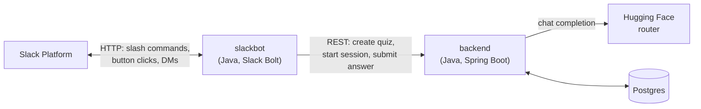
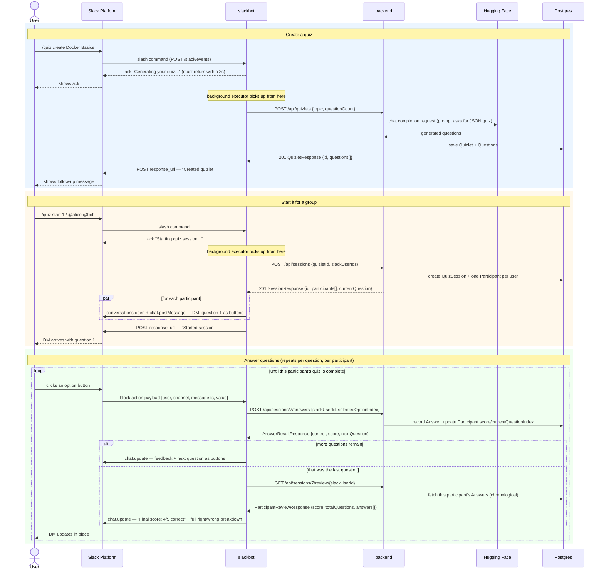

# AI Quizlet

A Slack bot that generates multiple-choice quizzes on any topic using an LLM, and
runs them as timed, per-user quiz sessions inside Slack — create a quiz, start it
for a group of teammates, everyone answers in their DMs, everyone's score is
trackable in the channel.

## Table of Contents

- [Architecture](#architecture)
  - [Full request/response flow](#full-requestresponse-flow)
  - [Is this over-engineered for what it does?](#is-this-over-engineered-for-what-it-does)
  - [Documentation map](#documentation-map)
- [Project layout](#project-layout)
- [Prerequisites](#prerequisites)
- [Step-by-step: deploy locally with Docker and connect it to Slack](#step-by-step-deploy-locally-with-docker-and-connect-it-to-slack)
  - [1. Configure environment variables](#1-configure-environment-variables)
  - [2. Start ngrok](#2-start-ngrok)
  - [3. Create the Slack app](#3-create-the-slack-app)
  - [4. Install the app and collect credentials](#4-install-the-app-and-collect-credentials)
  - [5. Build and start everything](#5-build-and-start-everything)
  - [6. Verify the backend directly (bypassing Slack)](#6-verify-the-backend-directly-bypassing-slack)
  - [7. Verify the slackbot endpoint is live](#7-verify-the-slackbot-endpoint-is-live)
  - [8. Test the whole thing from Slack](#8-test-the-whole-thing-from-slack)
  - [9. Tear down](#9-tear-down)
- [Restarting later: keep the Slack app URL in sync](#restarting-later-keep-the-slack-app-url-in-sync)
- [Local development without Docker](#local-development-without-docker)

## Architecture

Three pieces, each with exactly one job, talking in a straight line:



| Service | Role | Talks to |
|---|---|---|
| **[`slackbot`](slackbot)** | The **server** that receives everything Slack sends (slash commands, button clicks), and the **client** that calls the backend and the Slack Web API. Owns zero quiz state — pure translation layer. | Slack Platform (both directions), `backend` (client only) |
| **[`backend`](backend)** | The **server** slackbot talks to. Owns all quiz data (Postgres) and is the only thing that calls the AI provider. Has no idea Slack exists. | `slackbot` (server side), Hugging Face (client side), Postgres |

### Full request/response flow

Every module, one continuous journey: creating a quiz, starting it for a
group, answering questions, and the final score breakdown. (Per-command
diagrams for `list`/`delete`/`progress`/`help` — each a single fast
request/response, nothing this involved — are in
[`slackbot/ARCHITECTURE.md`](slackbot/ARCHITECTURE.md).)



### Is this over-engineered for what it does?

Worth answering directly since it's a fair question for a project this size:
**no, and here's the evidence, not just the assertion.**

- **`backend` has zero Slack coupling.** No Slack library in
  `backend/build.gradle`, no Slack import anywhere in `backend/src`. The only
  place "slack" appears is the field name `slackUserId` on `Participant` — a
  plain `String`, chosen because right now Slack is the only client, not
  because the backend understands anything Slack-specific. Renaming it to
  something generic like `externalUserId` would be a one-line, zero-behavior
  change whenever a second client shows up; doing that rename *now*, before
  a second client exists, would itself be premature.
- **`slackbot` has zero quiz logic.** It doesn't compute scores, doesn't know
  what a correct answer is, doesn't track question order — every one of
  those calls goes to `backend` and slackbot just renders the response
  (`AnswerActionService` reads `AnswerResultResponse.correct()`/`.score()`
  straight off the backend's reply; it never evaluates an answer itself).
- **The two-service split isn't new scope** — it's the multi-project Gradle
  layout requested at the very start of this project (`settings.gradle`
  already had `:backend` and `:slackbot` as separate modules before either
  had any code).
- **The one piece of real complexity in `slackbot`** — acking a slash
  command immediately and finishing the backend call on a background
  thread, then delivering the result via Slack's `response_url` — isn't
  optional engineering, it's Slack's hard requirement: every slash command
  and button click must be acknowledged within **3 seconds**, and quiz
  generation (an LLM call) routinely takes longer than that. Doing this
  inline would mean `/quiz create` visibly fails in Slack. See
  [`slackbot/ARCHITECTURE.md`](slackbot/ARCHITECTURE.md) for the exact flow.

Nothing here reaches for a queue, a cache, an event bus, or an extra
abstraction layer beyond "one Spring MVC service talking REST to another."
If you spot something that *is* overbuilt, it's worth flagging concretely —
this review just didn't find one.

### Documentation map

| Read this... | ...for |
|---|---|
| [`backend/ARCHITECTURE.md`](backend/ARCHITECTURE.md) | Backend data model, AI generation flow, REST API reference, sequence diagrams |
| [`slackbot/ARCHITECTURE.md`](slackbot/ARCHITECTURE.md) | Slack interaction model, the 3-second-ack pattern, sequence diagrams |
| [`slackbot/README.md`](slackbot/README.md) | Slackbot-only setup detail and troubleshooting (this file's Slack setup steps are the condensed version) |

[↑ Back to top](#table-of-contents)

## Project layout

```
.
├── settings.gradle, build.gradle    Root multi-project build; docker*/deploy* tasks per service
├── docker-compose.yml               Postgres + backend + slackbot, wired via .env
├── .env / .env.example              Local secrets (git-ignored) / template (tracked)
├── backend/                         Spring Boot REST API — quiz data, AI generation
│   └── src/main/java/com/aiquizlet/backend/{quiz,session,ai,common}
└── slackbot/                        Spring Boot Slack app (Bolt for Java)
    └── src/main/java/com/aiquizlet/slackbot/{config,backend,quiz}
```

[↑ Back to top](#table-of-contents)

## Prerequisites

- Docker + Docker Compose
- A [Hugging Face](https://huggingface.co/settings/tokens) account (free tier is fine) for a `HF_API_TOKEN`
- A Slack workspace you can install apps into (a free one at
  [slack.com/create](https://slack.com/create) works for testing)
- [ngrok](https://ngrok.com/download) (or another way to expose a local port over
  HTTPS) — only needed for local development, since Slack requires a public URL to
  deliver events to

Java/Gradle are **not** required on your machine beyond what's already vendored —
`./gradlew` bootstraps its own Gradle version, and Docker builds each service
with its own JDK. You only need a local JDK if you want to run a service outside
Docker (see the per-module READMEs).

[↑ Back to top](#table-of-contents)

## Step-by-step: deploy locally with Docker and connect it to Slack

This walks through everything from a clean checkout to a working `/quiz create`
in a real Slack workspace.

### 1. Configure environment variables

```sh
cp .env.example .env
```

Open `.env` and fill in `HF_API_TOKEN` (from
[huggingface.co/settings/tokens](https://huggingface.co/settings/tokens), Read
access is enough). Leave `SLACK_BOT_TOKEN` / `SLACK_SIGNING_SECRET` for step 4 —
you don't have them yet.

### 2. Start ngrok

Slack needs a public HTTPS URL to reach the bot before the app can be created.
The bot listens on port `8081`:

```sh
./gradlew ngrokStart
```

Prints the current tunnel's public URL — that's `<YOUR_PUBLIC_URL>` in the next
step. (Plain `ngrok http 8081` works identically if you'd rather run it
yourself; the task just also detects and reuses an already-running tunnel.)
Keep it running in the background — closing it kills the tunnel.

Free ngrok assigns a **new random URL every time it restarts**, which would
normally mean re-editing the Slack app config each time. Step 4 below sets up
`./gradlew slackManifestSync` so that after the first setup, a restart is just
one command instead of manual re-editing — see "Restarting later" near the
end of this guide.

### 3. Create the Slack app

Go to <https://api.slack.com/apps> → **Create New App** → **From an app
manifest** → pick your workspace → paste this, substituting your ngrok URL:

```yaml
display_information:
  name: AI Quizlet
  description: Create and play AI-generated quizzes with your team
oauth_config:
  scopes:
    bot:
      - commands
      - chat:write
      - im:write
settings:
  interactivity:
    is_enabled: true
    request_url: <YOUR_PUBLIC_URL>/slack/events
  org_deploy_enabled: false
  socket_mode_enabled: false
  token_rotation_enabled: false
features:
  bot_user:
    display_name: AI Quizlet
    always_online: true
  slash_commands:
    - command: /quiz
      url: <YOUR_PUBLIC_URL>/slack/events
      description: Create and play AI-generated quizzes
      usage_hint: "create <topic> | list | delete <id> | start <id> @user... | progress <sessionId> | help"
      should_escape: true
```

Slack validates this live on the preview screen and will point out anything it
doesn't recognize. Click **Create**.

### 4. Install the app and collect credentials

1. **OAuth & Permissions** → **Install to Workspace** → **Allow**.
2. Copy the **Bot User OAuth Token** (`xoxb-...`) from that page into `.env` as
   `SLACK_BOT_TOKEN`.
3. **Basic Information** → **App Credentials** → copy the **Signing Secret**
   into `.env` as `SLACK_SIGNING_SECRET`.

**Optional, one-time, while you're already on this page** — enables
`./gradlew slackManifestSync` later so you never have to manually re-paste an
ngrok URL into Slack again:

4. Same **Basic Information** page → copy the **App ID** into `.env` as
   `SLACK_APP_ID`.
5. Go to <https://api.slack.com/apps> (your apps list, not this app's pages) →
   scroll to **Your App Configuration Tokens** → **Generate Token** → copy the
   **Refresh Token** (starts `xoxe-`) into `.env` as `SLACK_CONFIG_REFRESH_TOKEN`.

### 5. Build and start everything

```sh
./gradlew composeUp
```

This builds both service jars, then builds and starts three containers:
`postgres`, `backend` (port `8080`), and `slackbot` (port `8081`, the one
ngrok is tunneling to) — equivalent to running
`docker compose up --build -d` yourself, but it also makes sure the jars
docker-compose bakes into each image are actually up to date first. Runs
detached, so it returns your prompt once the containers are started;
`docker compose logs -f` (or Docker Desktop) if you want to watch startup.

Confirm all three are up:

```sh
./gradlew composePs
```

(wraps `docker compose ps`; both this and `composeUp` need `docker` on your
`PATH`, same as the `docker*` tasks above.)

### 6. Verify the backend directly (bypassing Slack)

```sh
curl -X POST http://localhost:8080/api/quizlets \
  -H "Content-Type: application/json" \
  -d '{"topic":"Docker","questionCount":2}'
```

You should get back `201` with real generated questions. If this fails, the
problem is between `backend` and Hugging Face (check `HF_API_TOKEN`), not
Slack — fix it here before testing through Slack, since a `/quiz create`
failure would otherwise be ambiguous about which layer broke.

### 7. Verify the slackbot endpoint is live

```sh
curl -i -X POST http://localhost:8081/slack/events -d "probe=1"
```

Expect `400 Invalid Request` — that's the bot correctly rejecting an unsigned
request, which means it's up and verifying signatures. (A connection error
instead means the container isn't running or ngrok isn't tunneling to it.)

### 8. Test the whole thing from Slack

In your Slack workspace:

```
/quiz create Docker Basics
```
→ an immediate "Generating your quiz..." reply, then within a few seconds a
follow-up: "Created quizlet #1 on *Docker Basics* (5 questions). Start it with
`/quiz start 1 @user1 @user2 ...`"

```
/quiz start 1 @yourself
```
→ "Starting quiz session..." then a DM arrives with question 1 and four answer
buttons.

Click an answer → the DM updates in place with ✅/❌ feedback and the next
question, until the quiz is complete.

```
/quiz progress 1
```
→ posts your score to the channel.

If any step doesn't work, check the troubleshooting table in
[`slackbot/README.md`](slackbot/README.md#troubleshooting) — it covers the
specific symptom → cause mappings (signature mismatches, missing scopes,
backend connectivity, etc.) rather than repeating them here.

### 9. Tear down

```sh
docker compose down        # stop containers, keep the Postgres volume
docker compose down -v     # stop containers and delete quiz data too
```

[↑ Back to top](#table-of-contents)

## Restarting later: keep the Slack app URL in sync

Every time ngrok restarts it gets a **new random URL** (free tier), which
Slack won't know about until you tell it — the symptom is `/quiz` replying
"the app did not respond" even though everything's actually running fine,
just at a URL Slack no longer has. If you completed step 4's optional
`SLACK_APP_ID` / `SLACK_CONFIG_REFRESH_TOKEN` setup, fixing this is one
command instead of manually re-editing the Slack app config:

```sh
./gradlew slackManifestSync
```

This starts ngrok if it isn't already running (same as `ngrokStart`), then
pushes the current tunnel URL to the Slack app's Slash Command and
Interactivity Request URLs via Slack's Apps Manifest API
(`apps.manifest.update`). The manifest it pushes lives at
[`slackbot/slack-manifest.json`](slackbot/slack-manifest.json) — if you
change scopes, the slash command, or anything else app-shaped, edit that
file (it's the JSON equivalent of the YAML manifest from step 3).

A few things worth knowing about how this works:

- **The config token is single-use per sync.** Slack's app configuration
  access tokens expire after 12 hours, and `slackManifestSync` rotates
  (refreshes) it on every run — the new refresh token gets written back into
  `.env` automatically. Don't reuse an old copy of `.env`'s
  `SLACK_CONFIG_REFRESH_TOKEN` after running this; only the latest value is
  valid.
- **If the refresh token ever does expire or get invalidated** (e.g. `.env`
  restored from an old backup), the task fails with `invalid_refresh_token`
  — regenerate a new pair from **Your App Configuration Tokens** and update
  `.env` (same as step 4.5 above).
- **This only updates an already-created app.** It can't do the initial
  "Create New App" step — that's still the one-time manifest paste in step 3.

[↑ Back to top](#table-of-contents)

## Local development without Docker

Each service can run standalone against its own JDK/Gradle for faster
iteration — see [`backend/ARCHITECTURE.md`](backend/ARCHITECTURE.md) and
[`slackbot/README.md`](slackbot/README.md) for the `./gradlew bootRun` /
direct-jar instructions and the full environment variable reference.

[↑ Back to top](#table-of-contents)
