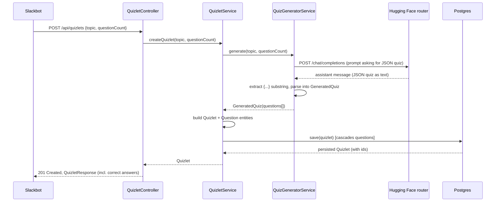
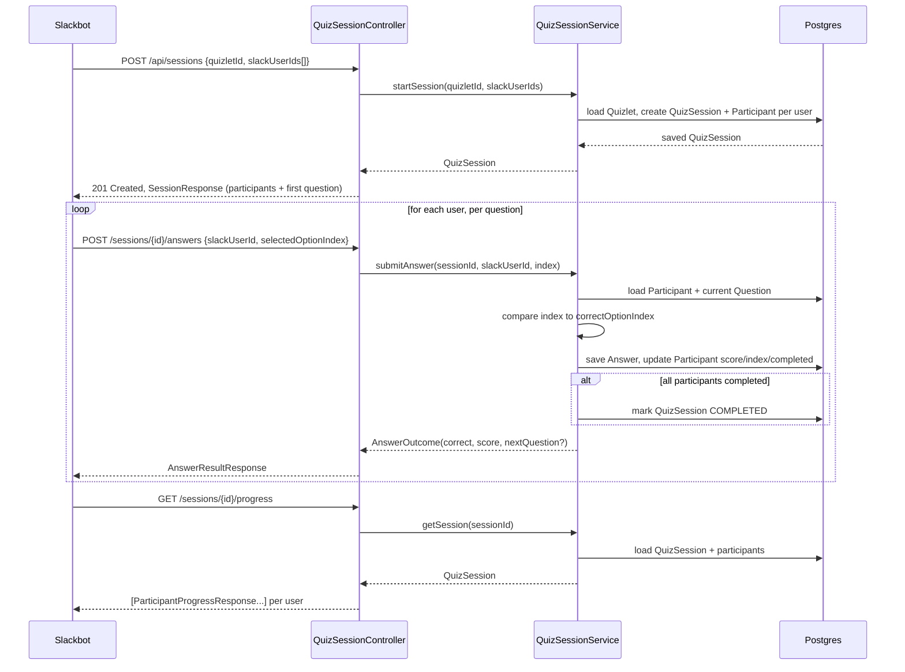

# AI Quizlet — Backend Architecture

> See also: [Slackbot Client Architecture](../slackbot/ARCHITECTURE.md) for
> how the Slack client is intended to drive this API.

## Table of Contents

- [Overview](#overview)
- [Tech stack](#tech-stack)
- [Package layout](#package-layout)
- [Data model](#data-model)
- [AI generation flow (`ai` package)](#ai-generation-flow-ai-package)
- [REST API](#rest-api)
- [Sequence diagrams](#sequence-diagrams)
  - [1. Creating a quizlet (AI generation)](#1-creating-a-quizlet-ai-generation)
  - [2. Starting a session and answering questions](#2-starting-a-session-and-answering-questions)
- [Configuration](#configuration)
- [Deliberate simplifications (skeleton stage)](#deliberate-simplifications-skeleton-stage)

## Overview

The backend is a Spring Boot REST service that lets a client (initially the
Slack bot) do three things:

1. Generate a quiz ("quizlet") of multiple-choice questions for a topic, using
   an LLM.
2. Start a quiz session for a group of subscribed Slack users.
3. Let each user answer questions one at a time and track their individual
   progress and score.

It is a plain layered Spring MVC application backed by Postgres via JPA —
no queues, no async workers. Each HTTP request is handled synchronously,
including the AI call made during quiz creation.

[↑ Back to top](#table-of-contents)

## Tech stack

| Concern          | Choice                                                         |
|-------------------|-----------------------------------------------------------------|
| Language / runtime | Java 21                                                        |
| Framework         | Spring Boot 3.3 (Web MVC, Data JPA)                             |
| Database          | PostgreSQL, accessed via Hibernate/JPA                          |
| AI provider       | Hugging Face Inference Providers router (OpenAI-compatible chat completions), model `meta-llama/Llama-3.1-8B-Instruct` |
| HTTP client to HF | Spring's built-in `RestClient` (no extra SDK dependency)        |
| Build             | Gradle (multi-project root, this module is `:backend`)          |
| Packaging/deploy  | `Dockerfile` + root `docker-compose.yml` (Postgres + backend)   |

[↑ Back to top](#table-of-contents)

## Package layout

```
com.aiquizlet.backend
├── quiz         Quiz authoring: Quizlet/Question entities, generation endpoint
├── session      Running a quiz for a group: sessions, participants, answers
├── ai           Talks to the Hugging Face router, turns text into structured quiz data
└── common       Cross-cutting concerns (exception → HTTP status mapping)
```

Each of `quiz` and `session` follows the same shape: `Entity` classes,
a `Repository` (Spring Data JPA), package-private `*Dtos` records for
request/response shapes, a `Service` holding the transactional logic, and a
`Controller` exposing it over REST.

[↑ Back to top](#table-of-contents)

## Data model

```
Quizlet 1───* Question
   │
   │ referenced by
   ▼
QuizSession *───1 Quizlet
   │
   └──1───* Participant (one per Slack user id)
                │
                └──1───* Answer *───1 Question
```

- **Quizlet** — a topic plus its ordered list of `Question`s. Created once by
  the AI generation flow and reused across many sessions.
- **Question** — text, exactly 4 options (`@ElementCollection`), and the
  zero-based `correctOptionIndex`. Never exposed to end users with the
  correct answer attached (see `QuestionPublicResponse`).
- **QuizSession** — one "playthrough" of a `Quizlet` by a group of Slack
  users. Holds `ACTIVE` / `COMPLETED` status.
- **Participant** — one Slack user's state within a session: `score`,
  `currentQuestionIndex` (which question they're on), `completed`.
- **Answer** — an immutable record of one submitted answer, linked to the
  `Question` and the `Participant` who answered it.

Progress tracking falls out of this model directly: a participant's
`currentQuestionIndex` / `score` / `completed` fields **are** their progress —
there's no separate aggregation step.

[↑ Back to top](#table-of-contents)

## AI generation flow (`ai` package)

`QuizGeneratorService` builds a single chat-completion request:

- System/user prompt asks for `questionCount` multiple-choice questions on a
  topic, instructing the model to reply with **only** a JSON object of the
  shape `{"questions": [{"text", "options": [4 strings], "correctOptionIndex"}]}`.
- Sent to `https://router.huggingface.co/v1/chat/completions` via `RestClient`
  (bean configured in `HuggingFaceConfig`, `Authorization: Bearer ${HF_API_TOKEN}`).
- The assistant's text reply is scanned for the first `{` ... last `}` and
  parsed into `GeneratedQuiz`/`GeneratedQuestion` records with Jackson —
  models don't have a hard JSON-mode guarantee here, so this extraction is
  deliberately lenient about leading/trailing prose.

`QuizletService.createQuizlet` calls this, then maps the generated records
into persisted `Quizlet`/`Question` entities in one transaction.

Failures talking to Hugging Face (bad token, network error, non-2xx) surface
as Spring's `RestClientException` and are translated by `ApiExceptionHandler`
into a `502 Bad Gateway` with a readable message, instead of a bare 500.

[↑ Back to top](#table-of-contents)

## REST API

| Method | Path                                    | Purpose                                              |
|--------|------------------------------------------|-------------------------------------------------------|
| POST   | `/api/quizlets`                         | Generate + persist a quizlet for a topic             |
| GET    | `/api/quizlets`                         | List every quizlet (id, topic, question count — no answers) |
| GET    | `/api/quizlets/{id}`                    | Fetch a quizlet, including correct answers            |
| DELETE | `/api/quizlets/{id}`                    | Delete a quizlet — `409` if any session references it |
| POST   | `/api/sessions`                         | Start a quizlet for a list of Slack user ids          |
| POST   | `/api/sessions/{id}/answers`            | Submit one user's answer to their current question   |
| GET    | `/api/sessions/{id}/progress`           | Progress for every participant                        |
| GET    | `/api/sessions/{id}/progress/{userId}`  | Progress for one participant                          |
| GET    | `/api/sessions/{id}/review/{userId}`    | Full per-question breakdown for one participant (score, and each question with the participant's answer + the correct one) |

Notes:

- `POST /api/sessions/{id}/answers` doesn't take a `questionId` — the server
  tracks each participant's current question itself, so the bot only ever
  needs to send `{slackUserId, selectedOptionIndex}`.
- Questions sent back to clients before they're answered
  (`QuestionPublicResponse`) never include `correctOptionIndex`; it's only
  revealed in the answer result once submitted.
- The review endpoint relies on `Participant.answers` being fetched in
  submission order (`@OrderBy("answeredAt ASC")` on that collection) so the
  breakdown lines up with the quiz's actual question order without the
  client having to re-sort anything.
- Deleting a quizlet relies on the `quiz_session.quizlet_id` foreign key
  constraint rather than an explicit "is this in use" check — `QuizletService`
  just calls `delete()`, and `ApiExceptionHandler` translates the resulting
  `DataIntegrityViolationException` into a `409 Conflict`. No cascade delete
  of sessions/participants/answers is configured, intentionally: deleting a
  quizlet should never silently erase someone's play history.

[↑ Back to top](#table-of-contents)

## Sequence diagrams

### 1. Creating a quizlet (AI generation)



### 2. Starting a session and answering questions



[↑ Back to top](#table-of-contents)

## Configuration

| Env var             | Default (in `application.yml`)              | Purpose                          |
|----------------------|-----------------------------------------------|-----------------------------------|
| `DB_HOST`            | `localhost`                                   | Postgres host                    |
| `DB_PORT`            | `5432`                                        | Postgres port                    |
| `DB_NAME`            | `quizlet`                                     | Postgres database                |
| `DB_USERNAME`        | `quizlet`                                     | Postgres user                    |
| `DB_PASSWORD`        | `quizlet`                                     | Postgres password                |
| `HF_API_TOKEN`       | *(none — required for quiz generation)*       | Hugging Face bearer token         |
| `HUGGINGFACE_MODEL`  | `meta-llama/Llama-3.1-8B-Instruct`            | Chat model used to generate quizzes |

Local values live in `.env` (git-ignored); `.env.example` is the template.
`docker-compose.yml` at the repo root wires these into a Postgres container
and the backend container together; `hibernate.ddl-auto: update` auto-creates
the schema on startup (no migration tool yet — fine for this stage, worth
revisiting before this goes anywhere near production data).

[↑ Back to top](#table-of-contents)

## Deliberate simplifications (skeleton stage)

- No authentication/authorization on the REST API — it's assumed to sit
  behind a trusted network boundary (called only by the Slackbot backend),
  not exposed directly to end users.
- No retry/backoff around the Hugging Face call — a failure surfaces
  immediately as a 502.
- No pagination on any list endpoint — progress lists are small (one row per
  session participant).
- Schema managed by `ddl-auto: update`, not a migration tool (Flyway/Liquibase) —
  acceptable while the schema is still moving; should change before this is
  backed by real user data.

[↑ Back to top](#table-of-contents)
