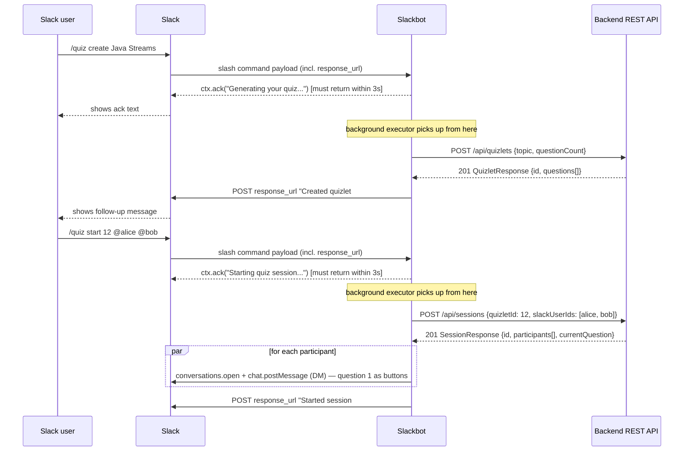
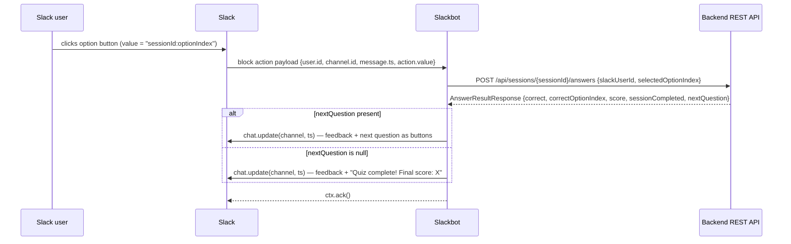
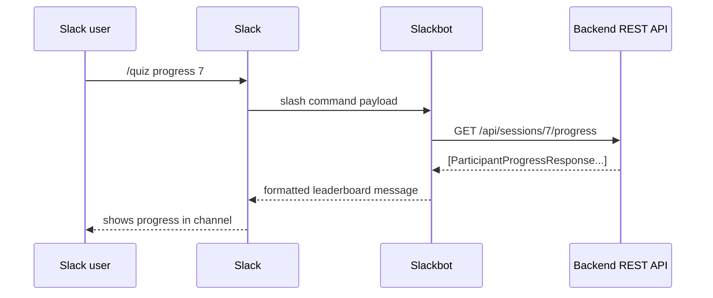

# AI Quizlet — Slackbot Client Architecture

> **Status: implemented.** Java + Spring Boot 3 + [Slack Bolt for
> Java](https://docs.slack.dev/tools/java-slack-sdk/), delivered over Slack's
> HTTP Events API (not Socket Mode). For how to actually create the Slack
> app and run this module, see [`README.md`](README.md) — this document is
> the design rationale and stays accurate to the implementation below.

## Responsibilities

The Slackbot is a thin client over the backend's REST API. It owns nothing
about quiz state itself — the backend is the source of truth for quizlets,
sessions, answers, and scores. The bot's job is purely to translate between
Slack's interaction model and the backend's HTTP API:

1. Let a user create a quizlet for a topic.
2. Let a user start that quizlet as a session with a group of subscribed
   users.
3. Present each participant their current question and collect their answer,
   one at a time, per user.
4. Show progress (score / questions answered / completion) for everyone in a
   session.

## Interaction model

Slack offers several UI primitives; the intended mapping is:

| Slack primitive                          | Used for                                              |
|--------------------------------------------|--------------------------------------------------------|
| Slash command (`/quiz ...`)                | Creating a quizlet, starting a session, checking progress |
| Block Kit interactive message (buttons)    | Presenting a question's 4 options and capturing an answer |
| Direct message per participant             | Delivering each user's question privately, so answers aren't visible to other participants |
| Message update (`chat.update`)             | Replacing a question message with "✅ Correct" / "❌ Incorrect, next question…" after answering |

Implemented commands (`QuizCommandService`):

- `/quiz create <topic>` (optionally `/quiz create <topic> | <questionCount>`)
  — calls `POST /api/quizlets`, replies with the new `quizletId` and question
  count, e.g. "Created quizlet #12 on *Java Streams* (5 questions). Start it
  with `/quiz start 12 @alice @bob`."
- `/quiz list` — calls `GET /api/quizlets` and lists every quizlet's id,
  topic, and question count (no correct answers — that endpoint returns the
  summary shape, not the full quiz).
- `/quiz delete <quizletId>` — calls `DELETE /api/quizlets/{id}`. The backend
  rejects this with a 409 if any session (past or present) references the
  quizlet — deletion is only for quizzes nobody has started yet, since
  sessions/participants/answers hold a required foreign key to their
  quizlet's questions and there's no cascade-delete of play history.
- `/quiz start <quizletId> @user1 @user2 ...` — calls `POST /api/sessions`
  with the resolved Slack user IDs, then DMs the first question to every
  participant as a Block Kit message with one button per option.
- Clicking an option button (`AnswerActionService`) — Slack sends a block
  action payload to the bot's request URL; the bot calls
  `POST /api/sessions/{sessionId}/answers` and updates that same message in
  place with the result and the next question. Once `nextQuestion` comes
  back null (the participant just answered their last question), it makes
  one more call — `GET /api/sessions/{sessionId}/review/{slackUserId}` — and
  replaces the message with the final score (X/Y correct) plus every
  question the participant saw, their answer, and the correct one for any
  they got wrong.
- `/quiz progress <sessionId>` — calls
  `GET /api/sessions/{sessionId}/progress` and posts a leaderboard-style
  summary to the channel the command was run in. The session id is a
  required argument today — see "Known limitations" below.
- `/quiz help`, a blank command, or an unrecognized subcommand — replies
  with the command list. No backend call.

**The 3-second ack constraint.** Slack requires every slash command and
block action to be acknowledged within 3 seconds. Quiz generation calls an
LLM and can take several seconds, so `create` and `start` don't call the
backend inline: they `ctx.ack()` immediately with a placeholder message, do
the real backend call on a background executor
(`Executors.newVirtualThreadPerTaskExecutor()`), and deliver the actual
result by POSTing to the command's `response_url` once it's ready
(`SlackResponder`). `progress` is a single fast backend read and answers
synchronously via `ctx.ack()`. Answering a question is also fast enough to
handle inline in `AnswerActionService`.

## Mapping Slack identities to backend participants

The backend's `Participant.slackUserId` is expected to be exactly Slack's
own user ID (e.g. `U0123ABC`) — no separate identity mapping table is
needed. The bot only has to resolve `@mentions` in the `/quiz start` command
to their Slack user IDs (Slack does this resolution for it) and pass them
straight through to `POST /api/sessions`.

## Session ↔ Slack context association

The backend has no notion of "channel" or "which Slack message this
question was posted in" — it only knows `sessionId` / `slackUserId` (the
backend tracks each participant's *current* question itself, so answering
never needs a `questionId` from the client — see
[`../backend/ARCHITECTURE.md`](../backend/ARCHITECTURE.md)). The bot needs
zero database of its own to route a button click back to the right backend
call: each option button's `value` is `"{sessionId}:{optionIndex}"`
(`SlackBlocks`), and the answering user's Slack id comes straight off the
block action payload (`payload.getUser().getId()`) — both fully recoverable
from the interaction itself, with nothing to persist bot-side.

## Sequence diagrams

### 1. Create + start a quiz

### 2. Answering a question

Fast enough to handle entirely inline — no background executor needed here.

### 3. Checking progress

## Configuration

Full setup steps (including creating the Slack app and its manifest) are in
[`README.md`](README.md). Summary:

| Env var                | Required | Purpose                                              |
|--------------------------|:--------:|---------------------------------------------------------|
| `SLACK_BOT_TOKEN`        | ✅ | Bot token (`xoxb-...`) used to call the Slack Web API   |
| `SLACK_SIGNING_SECRET`   | ✅ | Verifies that incoming requests genuinely came from Slack |
| `BACKEND_BASE_URL`       |    | Base URL of the backend REST API (default `http://localhost:8080`) |

Required bot scopes: `commands`, `chat:write`, `im:write`.

## Deliberate scope boundaries

- The bot does not generate or grade quizzes itself — every piece of quiz
  logic lives in the backend so it can be reused by other future clients.
- The bot keeps no state of its own at all (see "Session ↔ Slack context
  association" above) — it's safe to restart or run multiple instances
  behind a load balancer without any session affinity.
- No retry/idempotency handling for duplicate Slack retries (Slack retries
  slash commands / actions that don't ack within 3 seconds, and separately
  may redeliver if *its* request to us times out). A duplicate answer
  submission is rejected by the backend with a 400
  (`Participant ... has already completed the quiz`), but `AnswerActionService`
  currently just logs that as a failure rather than showing the user
  anything different — worth revisiting if duplicate deliveries turn out to
  be common in practice.
- `/quiz progress` requires an explicit `sessionId` — the bot doesn't track
  "the most recent session in this channel" anywhere, so the id from
  `/quiz start`'s reply has to be reused. Adding that lookup would need the
  small piece of channel-scoped state described as optional in earlier
  drafts of this design; deliberately left out for now to keep the bot
  fully stateless.
